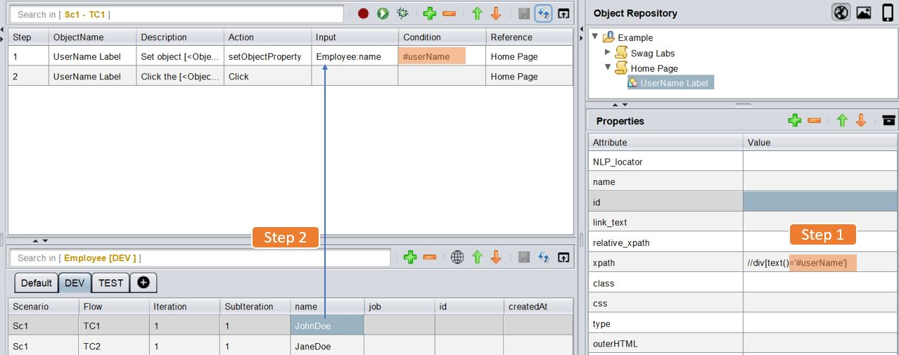

# Dynamic Object

-------------------------------

## **How To Change Object Properties At Run Time?**

Sometimes it is necessary to use a dynamic property for objects at runtime. Customizing the existing properties at runtime can be done by using **setObjectProperty** and **setglobalObjectProperty** functions. **setObjectProperty** function: will update property of the driving object. **setglobalObjectProperty** function: will update property for all the objects. 

### **setObjectProperty**

 * **setObjectProperty** action can be used by an object.

 * To provide dynamic property value, use the **Input** column.

 * To provide flag for replacing the property string, use the **condition** column.

 **Description**:  This function is used to customize any object property based on the requirement during the runtime. User can give a desired value as an input which will replace the matching condition in the object property. 

**Input Format** : @User Defined Text

**Condition Column** : #Variable name

**Usage:**

| ObjectName | Action | Input        | Condition |Reference|  |
|------------|--------|--------------|-----------|---------|--|
| Object     |*setObjectProperty*   | @value       | %var% | PageName|<span style="color:Green"><< *Hardcoded Input*</span> 
| Object     |*setObjectProperty*   | Sheet:Column | %var% | PageName|<span style="color:Blue"><< *Input from Datasheet*</span>
| Object     |*setObjectProperty*   | %dynamicVar% | %var% | PageName|<span style="color:Brown"><<*Input from variable*</span>

**Example** :

There is an object whose `xpath` is `//div[text()='JohnDoe']` and another object whose `xpath` is `//div[text()='JaneDoe']`

* **Step 1 :**

We can define one object in the Object Repository whose xpath can be parameterised as
`//div[text()='#userName']`. Now the **#userName** is also used in the **Condition** column

* **Step 2:**

We can parameterise the **#userName** part from a datasheet as shown in the image below :




**Internally uses the following Code:**

```java
private void setProperty(String key, String value) {
        if (!AutomationObject.dynamicValue.containsKey(Reference)) {
            Map<String, Map<String, String>> Object = new HashMap<>();
            Map<String, String> property = new HashMap<>();
            property.put(key, value);
            Object.put(ObjectName, property);
            AutomationObject.dynamicValue.put(Reference, Object);
        } else if (!AutomationObject.dynamicValue.get(Reference).containsKey(ObjectName)) {
            Map<String, String> property = new HashMap<>();
            property.put(key, value);
            AutomationObject.dynamicValue.get(Reference).put(ObjectName, property);
        } else {
            AutomationObject.dynamicValue.get(Reference).get(ObjectName).put(key, value);
        }
    }
```
--------------------------------

## **setglobalObjectProperty**

* **setglobalObjectProperty** action can be used by Browser object.

 * To provide dynamic property value, use the **Input** column.

 * To provide flag for replacing the property string, use the **condition** column.

 * Setting Global Object property is optional. To use object with global property when required, set **GlobalObject** in the **Condition** column.

**Description**:   This function is used to customize all objects’ property based on the requirement at runtime.User can give his desired value as an input which will replace the matching condition in the object's property.

**Input Format** :Input Column : @User Defined Text

**Condition Column** : #Variable name

**Usage:**

| ObjectName | Action | Input        | Condition |Reference|  |
|------------|--------|--------------|-----------|---------|--|
| Object     |*setglobalObjectProperty*   | @value       | %var% | PageName|<span style="color:Green"><< *Hardcoded Input*</span> 
| Object     |*setglobalObjectProperty*   | Sheet:Column | %var% | PageName|<span style="color:Blue"><< *Input from Datasheet*</span>
| Object     |*setglobalObjectProperty*   | %dynamicVar% | %var% | PageName|<span style="color:Brown"><<*Input from variable*</span>


    Note: It is also possible to use **setObjectProperty**/**setglobalObjectProperty** 
    for replacing multiple variables at the same time.

**Internally uses the following Code:**

```java
 @Action(object = ObjectType.BROWSER, desc = "Set  all objects property to [<Data>] at runtime.", input = InputType.YES, condition = InputType.YES)
    public void setglobalObjectProperty() {
        if (!Data.isEmpty()) {
            if (Condition.isEmpty()) {
                String[] groups = Data.split(",");
                for (String group : groups) {
                    String[] vals = group.split("=", 2);
                    AutomationObject.globalDynamicValue.put(vals[0], vals[1]);
                }
            } else {
                AutomationObject.globalDynamicValue.put(Condition, Data);
            }
            String text = String.format("Setting Global Object Property for %s with %s", Condition, Data);
            Report.updateTestLog(Action, text, Status.DONE);
        } else {
            Report.updateTestLog(Action, "Input should not be empty", Status.FAILNS);
        }
    }
```