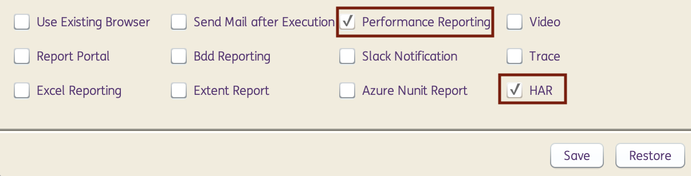

# **WebPage Performance Testing**
---------------------------------------

!!! info "What is Webpage Performance Testing?"

    Web Performance Testing is executed to provide accurate information on the readiness of an application through testing the web site and monitoring the server side application. This is done by simulating load as close as possible to the real conditions in order to evaluate if the application will support the expected load.

!!! abstract "How does INGenious perform Webpage Performance Tests?"
    INGenious can analyse the performance of a Web Page by using some built-in javascript based actions. The framework generates an **information-rich performance report** which is very handy to visualize which resource consumed how much time.

    Additionally, there is an option to **compare HAR files** and even set benchmarks.

    HAR is the short form for HTTP ARchive format, which tracks all the logging of web browser's interaction with a site. HAR files can be a requirement for troubleshooting issues specifically for problems such as performance and page rendering.

------------------------------------------------
## Actions

### **capturePageTimings**

**Description**: This action captures page navigation and resource timings parameters of the web page last opened or navigated to and stores it in the Performance Report and HAR file.

**Input Format** : @PageName

=== "Usage"

    | ObjectName | Action | Input        | Condition |Reference|  |
    |------------|--------|--------------|-----------|---------|--|
    | Browser     |:green_circle: [`capturePageTimings`](#)   | @value       |       | PageName|<span style="color:#349651">:arrow_left:   *Hardcoded Input*</span>
    | Browser     |:green_circle: [`capturePageTimings`](#)   | Sheet:Column |       | PageName|<span style="color:#559BD1">:arrow_left:   *Input from Datasheet*</span>
    | Browser     |:green_circle: [`capturePageTimings`](#)   | %dynamicVar% |       | PageName|<span style="color:#AB0066">:arrow_left:   *Input from variable*</span>

=== "Internally Uses"

    ```javascript
        var pt=performance.timing;
        var t={};
        t.title=document.title;
        t.url=window.location.href;
        for(var k in pt){t[k]=pt[k];}
        t.toJSON=undefined;
        return JSON.stringify(t);
    ```
-----------------------------------------


### **clearCache**

**Description**: Clears browser's data, for example cookies.

=== "Usage"

    | ObjectName | Action        | Input        | Condition |Reference|
    |------------|---------------|--------------|-----------|---------|
    | Browser    |:green_circle: [`clearCache`](#)   |              |           |         |

=== "Corresponding Code"

    ```java
        @Action(object = ObjectType.BROWSER, desc = "To delete all the cookies", input = InputType.NO)
        public void clearCache() {
            try {
                Page.context().clearCookies();
                Report.updateTestLog(Action, "Cookies Cleared", Status.DONE);
            } catch (Exception e) {
                Report.updateTestLog(Action, "Failed to clear cookies", Status.DONE);
            }
        }
    ```

---------------------------

## Create HAR files 

 * Use the action **`capturePageTimings`** on strategic pages

 * Navigate to **Configuration** > **Run Settings** and check the **Performance Reporting** and **Har** check boxes under the **Run settings tab**.

 

 * Once this configuration is saved, run your test set and post the execution you will get a report.Expand the report by clicking on your test case and this time the **console** icon on the bottom right will change into the **Performance Report icon**.

 * To launch the **performance report** click on the **Performance Report icon**.


 

 * The table and graph view contains the **har** files generated post execution.Click on them to get the various **page and resource timings parameters** captured by the **capturePageTimings** action.


---------------------------

## Compare Har Files

* To Compare your **Har** files, navigate to **Tools>Har Compare** and you will be redirected to the **Har Comparator** site.


* Here you compare the **Har** files that you have in your project.


* You can and also set **benchmarks** for achieving standards.

