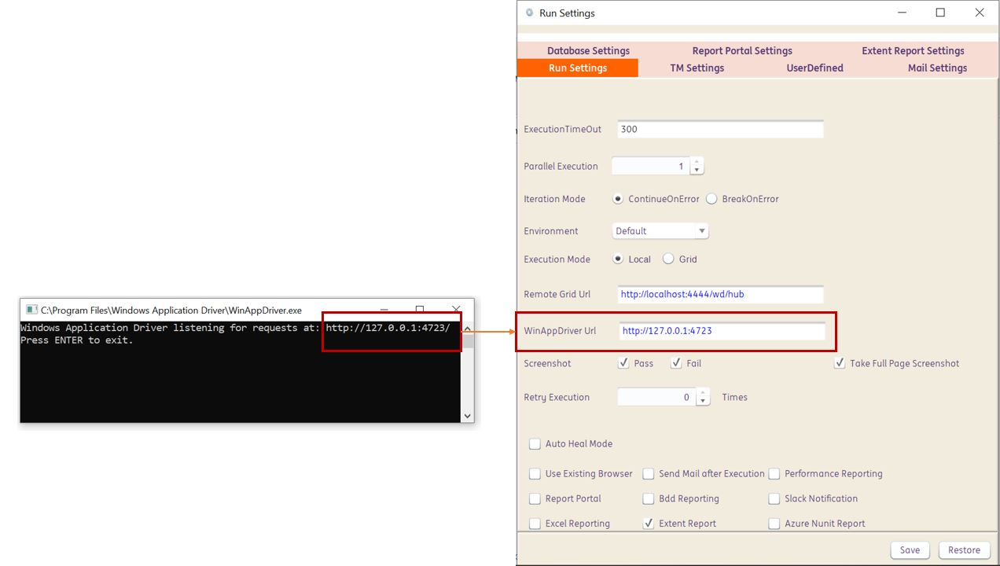
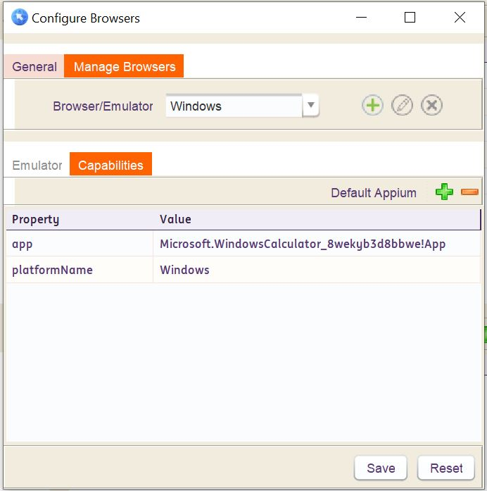
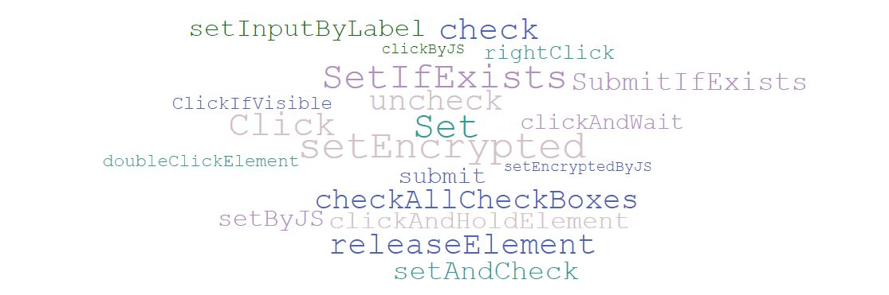
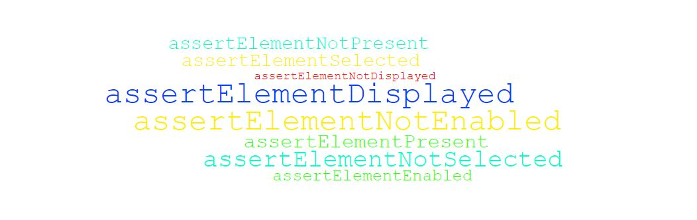
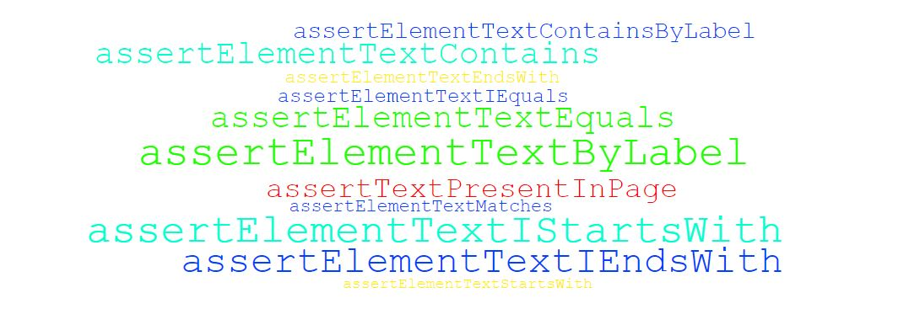

# **Windows Application Testing**
-----------------------------

<span style="color:Green">Windows Application Testing makes the framework more complete than ever. It allows us to test fat clients as easily as a web application. INGenious uses `WinAppDriver` which is an [open source tool from Microsoft](https://github.com/microsoft/WinAppDriver)  </span>

----------------------------------------

## Getting Started

**Install & Run WinAppDriver**

* Download Windows Application Driver installer from https://github.com/Microsoft/WinAppDriver/releases
* Run the installer on a Windows 10 machine where your application under test is installed and will be tested
* Enable `Developer Mode` in Windows settings
* Run WinAppDriver.exe from the installation directory (E.g. C:\Program Files\Windows Application Driver)

Windows Application Driver will then be running on the test machine listening to requests on the default IP address and port (`127.0.0.1:4723`).  WinAppDriver.exe can be configured to listen to a different IP address and port as follows:

```
WinAppDriver.exe 4727
WinAppDriver.exe 10.0.0.10 4725
WinAppDriver.exe 10.0.0.10 4723/wd/hub
```

**Inspect Element**

For GUI Inspection, use any of the following tools :

* [Accessibility Insights](https://accessibilityinsights.io/)
* Inspect.exe. For this [download the Windows SDK](https://developer.microsoft.com/en-us/windows/downloads/windows-sdk/)
* Other tools are listed [here](https://github.com/blackrosezy/gui-inspect-tool)

**Framework Setup**

* Enter the URL which you see when you run the WinAppDriver.exe, in the `WinAppDriver Url` field in Run Settings

 

* Set the Windows Capabilities in the `Configure Browsers` > `Manage Browsers` > `Capabilities`  window

 


-----------------------------------------

<span style="color:Green">The following are the **built-in Actions** within the framework to perform Windows Application Testing. At any point in time these actions can be modified or enhanced from the engine, based on the project needs.</span>

--------------------------------------------

## Windows Elements Actions

There are **24** built-in Actions. 

<span style="color:Red">**Please click the action-cloud below to check the details**</span>

 [](webActions/webelement.md)


--------------------------------------------
## Dropdown Actions

There are **17** built-in Actions. 

<span style="color:Red">**Please click the action-cloud below to check the details**</span>

 [](webActions/dropdown.md)

--------------------------------------------
## Dynamic Waits

There are **17** built-in Actions. 

<span style="color:Red">**Please click the action-cloud below to check the details**</span>

 [](webActions/dynamicwaits.md)

--------------------------------------------
 --------------------------------------------
## Dynamic Objects Actions

There are **2** built-in Actions. 

<span style="color:Red">**Please click the action-cloud below to check the details**</span>

 [](webActions/dynamicObjects.md)

---------------------------------------------

## Assertions

### Element Assertions

There are **8** built-in Actions. 

<span style="color:Red">**Please click the action-cloud below to check the details**</span>

 [](webActions/elementAssertions.md)

-------------------------------------

### Element Text Assertions

There are **12** built-in Actions. 

<span style="color:Red">**Please click the action-cloud below to check the details**</span>

 [](webActions/elementTextAssertions.md)

-------------------------------------

### Element Attribute Assertions

There are **9** built-in Actions. 

<span style="color:Red">**Please click the action-cloud below to check the details**</span>

 [](webActions/elementAttributeAssertions.md)

-------------------------------------

### Scroll Assertions

There are **4** built-in Actions. 

<span style="color:Red">**Please click the action-cloud below to check the details**</span>

 [](webActions/scrollassertions.md)

-------------------------------------

### Additional Assertions

There are **8** built-in Actions. 

<span style="color:Red">**Please click the action-cloud below to check the details**</span>

 [](webActions/additionalassertions.md)